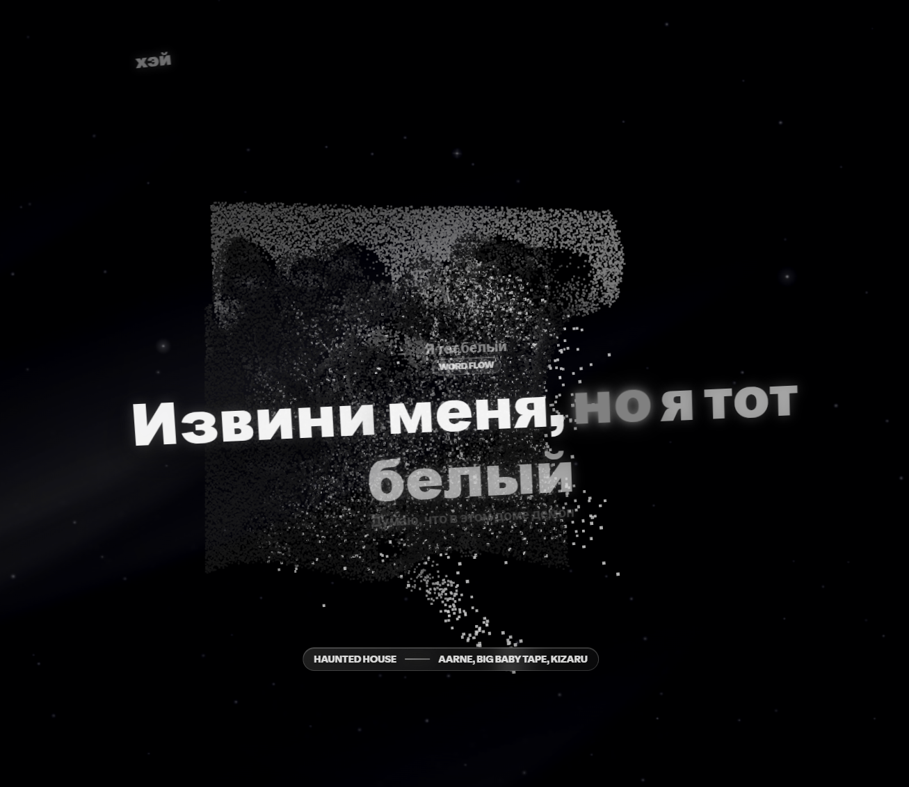

# novaplayer



novaplayer is a single-file Spicetify extension that turns Spotify into a fullscreen cinematic player with reactive cover art, synced lyrics, queue, playlists, and media controls.

## Features

- Fullscreen player opened from a topbar or playbar button.
- WebGL point-cloud album-cover visualizer with beat-reactive motion.
- Synced Spotify lyrics with word highlighting and instrumental interlude indicators.
- Upcoming queue and playlist drawer.
- Liquid-glass inspired lyrics, queue, and media controls.
- Track-switch transitions for cover art, lyrics, queue, and controls.
- Built-in tuning panel for point-cloud/cover-backdrop mode, visibility toggles, panel placement, queue count, lyrics sizing, accent inversion, and player visibility.

## Install

Install directly from GitHub in PowerShell:

```powershell
$extRoot = (spicetify path -e root).Trim(); New-Item -ItemType Directory -Force -Path $extRoot | Out-Null; iwr -UseBasicParsing "https://raw.githubusercontent.com/faceplantDev/novaplayer/main/novaplayer.js" -OutFile (Join-Path $extRoot "novaplayer.js"); spicetify config extensions novaplayer.js; spicetify apply
```

Or run from a cloned copy of this repository:

```powershell
.\install.ps1
```

The script copies `novaplayer.js` to the Spicetify extension directory reported by `spicetify path -e root`, adds it to `spicetify config extensions`, and runs `spicetify apply`.

Manual install:

```powershell
$extRoot = spicetify path -e root
Copy-Item .\novaplayer.js (Join-Path $extRoot "novaplayer.js") -Force
spicetify config extensions novaplayer.js
spicetify apply
```

## Update

Run the direct install flow again. This command overwrites the installed `novaplayer.js`, keeps the extension enabled, and applies Spicetify:

```powershell
$extRoot = (spicetify path -e root).Trim(); New-Item -ItemType Directory -Force -Path $extRoot | Out-Null; iwr -UseBasicParsing ("https://raw.githubusercontent.com/faceplantDev/novaplayer/main/novaplayer.js?t=" + [DateTimeOffset]::UtcNow.ToUnixTimeSeconds()) -OutFile (Join-Path $extRoot "novaplayer.js"); $configured = (spicetify config extensions 2>$null) -join " "; if ($configured -notmatch [regex]::Escape("novaplayer.js")) { spicetify config extensions novaplayer.js }; spicetify apply
```

## Use

After Spotify restarts, click the novaplayer visualizer button in the top bar or playbar. Press `Esc` or the close button to leave the fullscreen player.

## Uninstall

```powershell
.\uninstall.ps1
```

## Marketplace Publishing

This repository is ready for Spicetify Marketplace discovery as an extension:

- keep `manifest.json` in the repository root;
- keep `preview.png`, `README.md`, and `novaplayer.js` in the paths referenced by the manifest;
- publish the repository as public on GitHub;
- add the GitHub topic `spicetify-extensions`.

## Notes

- Lyrics come from Spotify's internal `color-lyrics` endpoint through `Spicetify.CosmosAsync`; tracks without available lyrics hide the lyrics ribbon, and long vocal gaps show an interlude indicator instead of holding the last lyric as current.
- Beat motion uses `Spicetify.getAudioData` when audio analysis is available, with a soft fallback pulse otherwise.
- Queue data is built from `Spicetify.Queue.nextTracks` and `Spicetify.Player.data.nextItems`.
- Up Next can show more queue entries from the settings panel instead of hiding after the compact carousel count.
- novaplayer is an original implementation.
